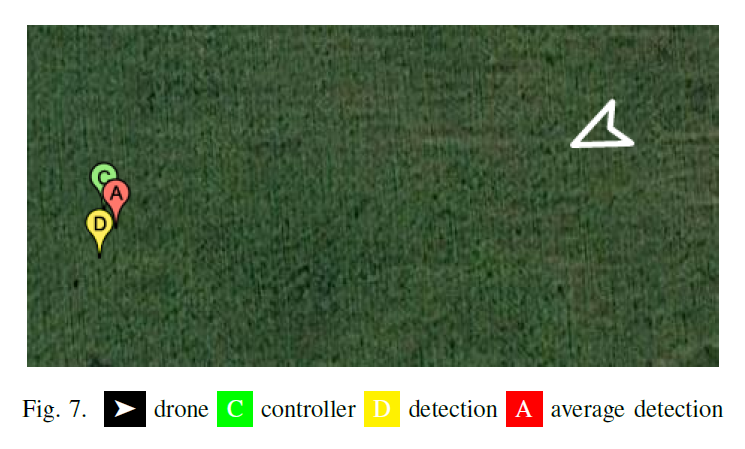

# Real-Time Hazard Symbol Detection and Localization Using UAV Imagery

This repository will contain the code required to support the paper submitted to VTC-2017 Fall conference. Right now, only a demo video is available that demonstrates the algorithm functionality. Once the code has been cleaned up, it will become available here.

This video is temporary and will be completed with commentary later on, it should however already demonstrate the algorithm's functionality. As further reference, the image below (taken from the paper) explains what the different markers mean.

  

#Training the YOLOv2 Object Detection Algorithm
I have written an article detailing the procedure how YOLOv2 can be trained to detect custom objects, it can be found [here](https://timebutt.github.io/static/how-to-train-yolov2-to-detect-custom-objects/). The sample NFPA data set as used in the paper is available. 
