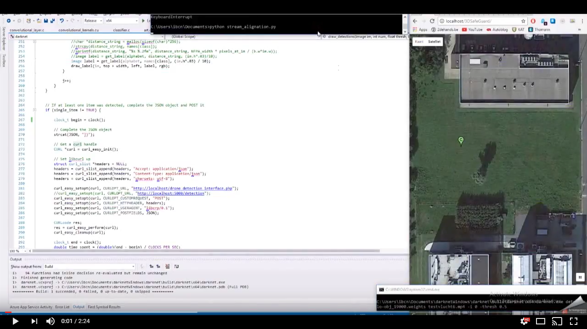

# Real-Time Hazard Symbol Detection and Localization Using UAV Imagery

This repository will contain the code required to support the paper submitted to VTC-2017 Fall conference. Right now, only a demo video is available that demonstrates the algorithm functionality. Once the code has been cleaned up, it will become available here.

This video is temporarily and will be completed with commentary later on.
